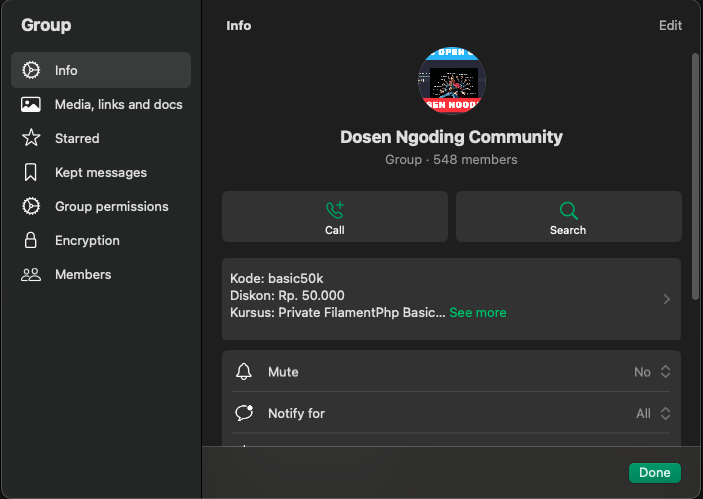

import { Card, CardGrid } from "@astrojs/starlight/components";

## Apa saja yang akan kamu pelajari?

<CardGrid>
  <Card title="Starter Project Kaido-Kit" icon="rocket">
    Di Course ini kamu akan belajar membuat aplikasi antrian real time dengan Laravel Filament Livewire dan Reverb menggunakan starter project Kaido-Kit.

    Apa itu Kaido Kit ? [Cek Repo Github](https://github.com/siubie/kaido-kit).
  </Card>
  <Card title="Belajar Sambil Build Portofolio" icon="star">
    Dengan mengikuti course ini, kamu tidak hanya belajar teori, tetapi juga langsung praktek membuat aplikasi yang bisa kamu tambahkan ke portofolio.
  </Card>
  <Card title="Dapat Source Code Siap Jual" icon="setting">
    Di akhir course, kamu akan mendapatkan source code aplikasi antrian real time yang siap untuk kamu jual atau kembangkan lebih lanjut.
    Kamu bisa menggunakannya sebagai dasar untuk proyek-proyek selanjutnya.
  </Card>
  <Card title="Dapat Apa Aja ?" icon="open-book">
    Di course ini materi yang didapatkan dalam bentuk apa aja ? 
    - Video Tutorial
    - Source Code
    - Akses ke Grup Whatsapp Private
    - Zoom Meeting Live Coding (Khusus yang Pre Order)
  </Card>
</CardGrid>

## Apa saja Fitur yang akan kamu buat?
<CardGrid stagger="true"> 
  <Card title="Sistem Antrian Multi Cabang" icon="list">
    Sistem antrian yang dipelajari di course ini mendukung sistem antrian multi cabang, cocok untuk client yang memiliki beberapa lokasi atau cabang. 
  </Card>
  <Card title="Multi Loket" icon="bell">
    Sistem ini mendukung multi loket dinamis yang dapat ditambahkan atau dikurangi sesuai kebutuhan.
  </Card>
  <Card title="Antrian Real Time" icon="user">
    Antrian dapat dimonitor secara real time, sehingga pengguna dapat melihat status antrian secara online dan real time.
  </Card>
  <Card title="Support Multi Hak Akses" icon="users">
    Di Course ini diajarkan bagaimana membuat sistem yang multi role dan multi hak akses di Laravel menggunakan Filament Shield (Laravel Spatie Permission)
  </Card>
  <Card title="Fitur Reporting" icon="users">
    Sistem dilengkapi dengan fitur reporting yang memudahkan admin untuk melihat statistik antrian.
  </Card>
</CardGrid>
## Testimonial dari Alumni Course Dosen Ngoding
**Dosen Ngoding telah melatih lebih dari 1000+ developer di Indonesia via [Udemy](https://www.udemy.com/user/putraprima/) dengan Rating Course 4.8.**
<CardGrid stagger="true">
  <Card title="Laravel Rest Api - Review 4.9 ⭐⭐⭐⭐⭐">
  
  </Card>
  <Card title="Laravel Starter Code - Review 4.8 ⭐⭐⭐⭐⭐">
  
  </Card>
  <Card title="Laravel File Upload - Review 4.7 ⭐⭐⭐⭐⭐">
  
  </Card>
  <Card title="Quality Assurance Engineer - Review 4.9 ⭐⭐⭐⭐⭐">
  
  </Card>
</CardGrid>
## Akses Source Code Langsung di Github
Di dosenngoding source code di share langsung di github, jadi kamu bisa akses source code kapan saja.

## Butuh Diskusi ? tenang ada group private di Whatsapp dan Group Community yang aktif banget !!

## Demo Aplikasi Antrian Real Time 
Video Demo
## Berapa Harga Course ini?
Paket Zoom Live Coding (Khusus Pre Order)
Harga Pre Order Pertama: Rp. 99.000,- (Harga Normal Rp. 149.000,-)
Harga Pre Order Kedua: Rp. 125.000,- (Harga Normal Rp. 149.000,-)

Paket Non Zoom Live Coding
159.000,-